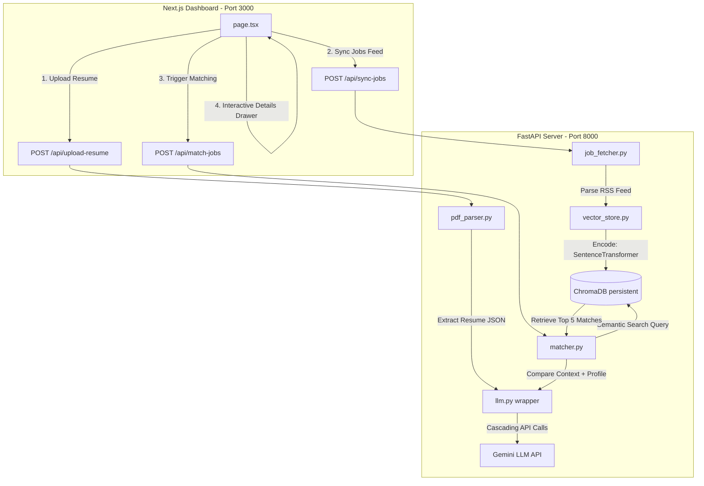
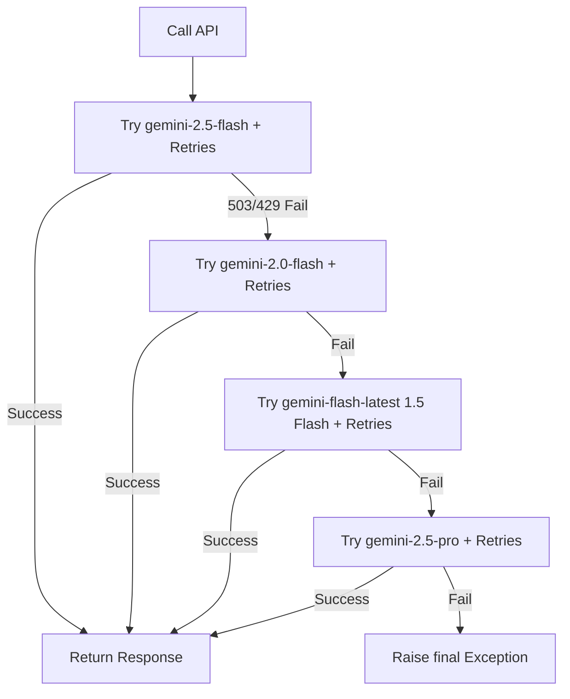

# RepoMind RAG Matcher 🚀

RepoMind RAG Matcher is a production-grade full-stack job recommendation engine. It processes raw PDF resumes, extracts structured candidate details using LLM schema validation, fetches active remote jobs, indexes them into a local vector database, and runs semantic retrieval with comparative AI analysis to recommend matching positions.

---

## 🏗️ Full-Stack Architecture

The project is structured into a modular **FastAPI** backend (for ML embeddings, local vector index, and Gemini orchestration) and a **Next.js** App Router frontend (styled using responsive vanilla CSS).



---

## 🛠️ Core Algorithms & RAG Workflows

### 1. Document Parsing & LLM Schema Constraining
PDF text extraction uses `pdfplumber` page-by-page. To parse this text reliably, we use **constrained decoding** in the `google-genai` SDK. By passing a Pydantic `BaseModel` schema to `response_schema`, Gemini's text generation is constrained to only output valid JSON keys and data types matching our definition:
```python
class CandidateProfile(BaseModel):
    name: str
    email: str
    phone: Optional[str]
    skills: List[str]
    experience_years: float
    summary: str
    target_roles: List[str]
```

### 2. Dense Vector Embeddings (SentenceTransformers)
Instead of matching exact keywords, we capture semantic meaning using the **`all-MiniLM-L6-v2`** model.
*   **Dimensionality**: It maps text passages into a **384-dimensional** floating-point vector.
*   **Context Concatenation**: To embed a job listing, we merge the title, company, and description:
    $$\vec{v}_{\text{job}} = f_{\text{embed}}(\text{Title} + \text{Company} + \text{Description})$$
*   **Query Vector**: We embed the candidate profile's target roles and skills:
    $$\vec{v}_{\text{query}} = f_{\text{embed}}(\text{Target Roles} + \text{Skills} + \text{Summary})$$

### 3. Euclidean Distance-to-Similarity Score Mapping
ChromaDB uses L2 (Squared Euclidean) distance by default to find vector proximity:
$$d(\vec{u}, \vec{v}) = \sum_{i=1}^{n} (u_i - v_i)^2$$
Since distances are not intuitive for user interfaces, we convert the L2 distance into a normalized percentage similarity score:
$$\text{Similarity Score} = \max\left(0, \min\left(100, \left(1.0 - \frac{d}{2.0}\right) \times 100\right)\right)$$

### 4. Cascading LLM Fallback (High Availability)
During spikes in usage, LLMs can return 503 (Unavailable) or 429 (Rate Limit) errors. To prevent crashes, we implement a **cascading model router**:


---

## 📁 Repository Structure

```
SENTENCE TRANSFORMER/
├── backend/                  # FastAPI Backend
│   ├── .venv/                # Python Virtual Environment
│   ├── chroma_db/            # SQLite/ChromaDB Persistent Store
│   ├── services/
│   │   ├── llm.py            # Gemini Client + tenacity retries + fallback routing
│   │   ├── pdf_parser.py     # pdfplumber PDF text extractor
│   │   ├── job_fetcher.py    # RSS XML Feed Parser for WeWorkRemotely
│   │   ├── vector_store.py   # SentenceTransformers client + ChromaDB query engine
│   │   └── matcher.py        # Semantic Match Retriever & Recruit Coach Generator
│   ├── main.py               # API routing endpoints
│   └── requirements.txt      # Python package locks
│
└── frontend/                 # Next.js Frontend (App Router)
    ├── src/
    │   ├── app/
    │   │   ├── globals.css   # Premium dark slate stylesheet & glassmorphic cards
    │   │   ├── layout.tsx    # Next.js global frame
    │   │   └── page.tsx      # match Dashboard UI, upload, sync & drawer overlays
    ├── package.json          # Node dependencies
    └── tsconfig.json         # TypeScript configuration
```

---

## ⚡ Getting Started & Installation

### Prerequisite Versions
*   **Python**: `3.10` or higher
*   **Node.js**: `18.x` or higher
*   **npm**: `9.x` or higher

### 1. Setup Backend
1.  Navigate into the `backend/` directory:
    ```bash
    cd backend
    ```
2.  Activate the virtual environment:
    *   **Windows Powershell**:
        ```powershell
        .venv\Scripts\Activate.ps1
        ```
    *   **Mac/Linux**:
        ```bash
        source .venv/bin/activate
        ```
3.  Configure your Gemini API key in `backend/.env`:
    ```env
    GEMINI_API_KEY=your_gemini_api_key_here
    ```
4.  Run the FastAPI backend using uvicorn:
    ```bash
    python -m uvicorn main:app --host 127.0.0.1 --port 8000
    ```

### 2. Setup Frontend
1.  Open a new terminal and navigate to the `frontend/` directory:
    ```bash
    cd frontend
    ```
2.  Install npm dependencies:
    ```bash
    npm install
    ```
3.  Run the Next.js dev server:
    ```bash
    npm run dev
    ```
4.  Open your browser and navigate to **[http://localhost:3000](http://localhost:3000)**.

---

## 📡 API Reference Documentation

When running locally, Swagger API docs are available interactively at **[http://localhost:8000/docs](http://localhost:8000/docs)**.

| Endpoint | Method | Payload | Description |
| :--- | :--- | :--- | :--- |
| `/api/health` | `GET` | *None* | Verifies API server connection status. |
| `/api/upload-resume` | `POST` | `multipart/form-data` (PDF file) | Extracts resume text and returns a Candidate JSON. |
| `/api/sync-jobs` | `POST` | `?limit=50` (Query Param) | Downloads WeWorkRemotely RSS feed and indexes them in vector db. |
| `/api/match-jobs` | `POST` | `CandidateProfile` JSON body | Semantically searches jobs and evaluates match metrics. |
